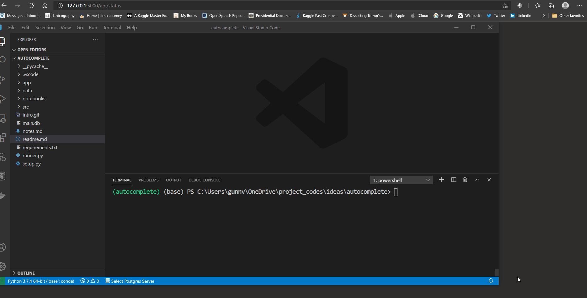

# Auto-complete
This repository contains the code to create a frequency based autocomplete system. The structure of the project is as follows:

```bash
|--app
|    |--db
|    |--routes
|--data   
|    |--convo.text
|--notebooks
|--src
|    |--ngrams.py
|--main.db
|--readme.md
|--runner.py
|--setup.py
```
`app` directory contains flask based autocomplete server. `notebooks` directory contains the runner code to create `n-gram` frequency files from raw text files present in `data` directory. `src` contains the code to generate n-grams, this uses NLTK routines to accomplish creation of frequency files.

If you want to run this project locally, then make sure you carry out the following sequence of steps:

1. Run the notebook in the `notebooks` folder. This will create three files in data folder namely:
   - unigrams.csv
   -  bigrams.csv
   - trigrams.csv
2. Now create a new venv using `requirements.txt`
3. After this run `setup.py`, this will create a sqlite3 database named `main.db`
4. Now setup the following environment variables to run the flask server (Tested on Windows only):
   - `$env:FLASK_APP=runner`
   - `$env:FLASK_ENV = "devlopement"`
   - `$env:DEBUG = 1`
5. Type type `flask-run`
6. Go to the url `http://127.0.0.1:5000/api/status` to check if the server is running, you will see a response of `{"healthy":true}`
7. To get suggestions use query parameters as shown below:
   
   `http://127.0.0.1:5000/api/query?string=word1,word2,word3`

